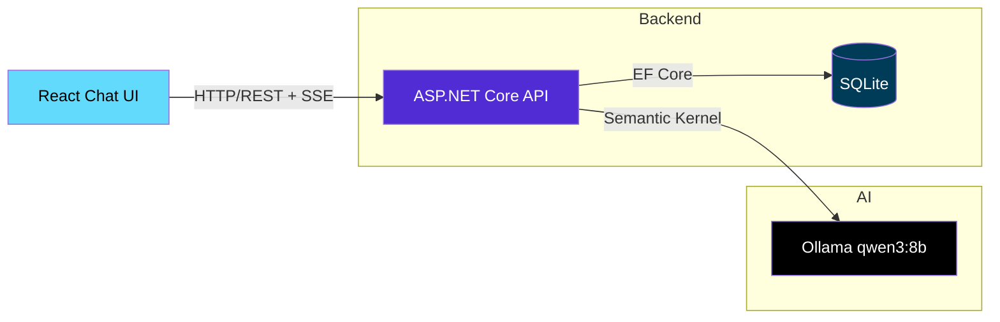

# Smart FAQ Chatbot

> A full-stack AI chatbot that **remembers your conversation**, streams answers token-by-token, and saves every session to a database — built with **ASP.NET Core 10**, **React 19**, **Semantic Kernel**, and **Ollama (qwen3:8b)**.

**Status:** ✅ Working end-to-end locally — backend API, streaming, session persistence, and React UI all built and verified.

[](https://dotnet.microsoft.com/)
[](https://react.dev/)
[](https://www.typescriptlang.org/)
[](https://learn.microsoft.com/en-us/semantic-kernel/)
[](https://ollama.com/)
[](https://learn.microsoft.com/en-us/ef/core/)
[](https://www.sqlite.org/)
[](LICENSE)

---

## 🎯 Project Overview

**Smart FAQ Chatbot** is a full-stack AI-powered conversational assistant that demonstrates modern .NET and React development practices. It maintains multi-turn conversation context, persists chat history to a local SQLite database, and streams token-by-token responses for a natural chat experience.

### At a Glance (60 seconds)

- **What it does:** answers questions in a ChatGPT-style interface, remembers follow-ups ("Does that apply to sale items?"), and keeps every conversation saved across restarts.
- **Who it's for:** anyone needing an FAQ assistant — customers, support teams, or internal knowledge bases.
- **How it's built:** a clean three-layer .NET backend (Core / Infrastructure / API) serving a React chat UI, powered by a locally-run AI model — no cloud bills, no data leaving the machine.

### Why This Project Stands Out

| Feature                 | Implementation                                                                       |
| ----------------------- | ------------------------------------------------------------------------------------ |
| **Conversation Memory** | Semantic Kernel `ChatHistory` with role-aware context (System/User/Assistant)        |
| **Session Persistence** | EF Core + SQLite — sessions survive app restarts                                     |
| **Streaming UX**        | Server-Sent Events (SSE) for token-by-token rendering                                |
| **Production Patterns** | Polly resilience, FluentValidation, rate limiting, structured logging, health checks |
| **Clean Architecture**  | Core / Infrastructure / API separation with dependency inversion                     |
| **Config-Driven LLM**   | Endpoint, model, and history budget all driven by `appsettings.json`                 |

---

## 🏗️ Architecture



### Tech Stack

| Layer                | Technology                                                    |
| -------------------- | ------------------------------------------------------------- |
| **Backend API**      | ASP.NET Core 10 (Controllers, Minimal APIs where appropriate) |
| **AI Orchestration** | Microsoft Semantic Kernel (ChatHistory, Streaming)            |
| **LLM**              | Ollama local — `qwen3:8b` (endpoint/model set via config)     |
| **Database**         | SQLite via EF Core 10 (Code-First Migrations)                 |
| **Frontend**         | React 19 + TypeScript + Vite + Bootstrap 5.3                  |
| **Resilience**       | Polly (Retry, Circuit Breaker, Timeout)                       |
| **Validation**       | FluentValidation                                              |
| **Observability**    | Serilog (Structured Logging), Health Checks                   |
| **API Docs**         | Scalar (OpenAPI/Swagger UI)                                   |

---

## ✨ Features

Everything below is implemented and verified — not planned.

### Core Chat Experience

- 💬 **Multi-turn conversations** — last 10 turns sent as context (`LLM:MaxTurns`), full history kept in the DB
- 📝 **Markdown rendering** — headings, lists, tables, links, and dark code blocks
- ⚡ **Streaming responses** — tokens appear in real-time via SSE (camelCase `{role, content, done}` events)
- 🌙 **Dark/Light mode** — system-aware on first load, manual toggle persisted to `localStorage`
- 💡 **Suggestion chips** — one-click example prompts on the empty state
- ⌨️ **Keyboard-first composer** — Enter to send, Shift+Enter for newline, auto-growing input

### Session Management

- ➕ Create new chat sessions (sidebar refreshes automatically after your first message)
- 📋 Session cards with title initial avatars and last-updated dates
- 🔄 Switch between sessions instantly
- 🗑️ Delete sessions (hover-reveal action)
- 💾 **Full persistence** — SQLite survives restarts

### Production Readiness

- ✅ Input validation (FluentValidation, 10k char limit)
- ✅ Rate limiting (60 req/min per IP → `429`)
- ✅ Request size limits (Kestrel 50 KB)
- ✅ Retry + Circuit Breaker + Timeouts (Polly resilience handler)
- ✅ Structured logging (Serilog)
- ✅ Health endpoints (`/health`, `/health/ready` — SQLite + Ollama checks)
- ✅ API documentation (Scalar at `/scalar/v1` in Development)

---

## 🚀 Quick Start

### Prerequisites

- [.NET 10 SDK](https://dotnet.microsoft.com/download/dotnet/10.0)
- [Node.js 20+](https://nodejs.org/)
- [Ollama](https://ollama.com/) with `qwen3:8b` model

```bash
# Pull the model
ollama pull qwen3:8b
```

### Run Locally

```bash
# 1. Clone and navigate
git clone <your-repo-url>
cd SmartFaqChatbot

# 2. Start Ollama (separate terminal)
ollama serve

# 3. Backend: run (new terminal)
cd server/SmartFaqChatbot.Api
dotnet run
# API runs on http://localhost:5291
# - Scalar docs: http://localhost:5291/scalar/v1 (Development)
# - Health: http://localhost:5291/health and /health/ready
# DB auto-migrates on startup to server/SmartFaqChatbot.Api/chatbot.db
# (manual `dotnet ef database update` also works if you prefer)

# 4. Frontend: Install & run (another new terminal)
cd client
npm install
npm run dev
# UI runs on http://localhost:5173 (Vite proxies /api to the backend)
```

### Environment Configuration

`server/SmartFaqChatbot.Api/appsettings.json` already ships with local defaults:

```json
{
  "ConnectionStrings": {
    "DefaultConnection": "Data Source=chatbot.db"
  },
  "LLM": {
    "Endpoint": "http://localhost:11434",
    "Model": "qwen3:8b",
    "ApiKey": "",
    "MaxTurns": 10
  }
}
```

- `LLM:Endpoint` / `LLM:Model` — local Ollama by default; point at any OpenAI-compatible endpoint if you switch models.
- `LLM:ApiKey` — leave empty for local Ollama; set a bearer token if your endpoint requires auth.
- `LLM:MaxTurns` — how many recent turns are sent to the model (token budget); the full history stays in SQLite.

---

## 📁 Project Structure

```
SmartFaqChatbot/
├── server/
│   ├── SmartFaqChatbot.Api/           # Controllers, Program.cs, DI config
│   │   ├── Controllers/
│   │   │   ├── ChatController.cs      # POST /api/chat, /api/chat/stream (SSE)
│   │   │   └── SessionsController.cs  # CRUD for sessions/messages
│   │   ├── DTOs/                      # SessionDto / MessageDto + mappings
│   │   ├── Health/                    # OllamaHealthCheck
│   │   ├── Validation/                # ChatRequestValidator
│   │   └── Program.cs                 # Serilog, Polly, rate limiting, health, Scalar, CORS
│   ├── SmartFaqChatbot.Core/          # Domain: Entities, Interfaces, DTOs
│   │   ├── Entities/
│   │   │   ├── ChatSession.cs
│   │   │   └── ChatMessage.cs
│   │   ├── Interfaces/
│   │   │   └── IChatService.cs
│   │   └── DTOs/                      # ChatRequest / ChatResponse / ChatMessageContent
│   └── SmartFaqChatbot.Infrastructure/ # Implementations: EF Core, Ollama Service
│       ├── Data/
│       │   └── AppDbContext.cs
│       ├── Options/
│       │   └── LlmOptions.cs          # LLM:Endpoint/Model/ApiKey/MaxTurns
│       ├── Services/
│       │   └── OllamaChatService.cs   # ChatHistory + trimming + streaming + persistence
│       └── Migrations/
├── client/                            # React + TypeScript + Vite
│   ├── src/
│   │   ├── components/
│   │   │   ├── ChatWindow.tsx         # scroll container + suggestion empty state
│   │   │   ├── ChatMessage.tsx        # avatars, markdown, hover copy
│   │   │   ├── ChatInput.tsx          # auto-grow composer
│   │   │   ├── SessionList.tsx        # session cards
│   │   │   └── ThemeToggle.tsx
│   │   ├── hooks/
│   │   │   ├── useChat.ts             # streaming state machine
│   │   │   ├── useSessions.ts
│   │   │   └── useTheme.ts
│   │   ├── services/
│   │   │   └── api.ts                 # REST + SSE reader (case-tolerant chunk parsing)
│   │   ├── types.ts
│   │   ├── styles.css
│   │   └── main.tsx
│   ├── vite.config.ts                 # /api proxy → http://localhost:5291
│   └── package.json
├── SmartFaqChatbot.slnx
└── README.md
```

---

## 🔌 API Reference

### Chat Endpoints

| Method | Endpoint           | Description                                  |
| ------ | ------------------ | -------------------------------------------- |
| `POST` | `/api/chat`        | Non-streaming reply (persists history)       |
| `POST` | `/api/chat/stream` | SSE streaming reply (persists on completion) |

**Request:**

```json
{
  "sessionId": "guid-or-null",
  "content": "What is your refund policy?"
}
```

**Non-streaming Response:**

```json
{
  "sessionId": "guid",
  "content": "Our refund policy..."
}
```

**Streaming Response (SSE):**

SSE events are serialized with **camelCase** keys — the client depends on this contract:

```
data: {"role":"assistant","content":"Our","done":false}
data: {"role":"assistant","content":" refund","done":false}
data: {"role":"assistant","content":" policy...","done":true}
```

**Status codes:** `400` for validation failures (empty / >10k chars), `429` when the per-IP rate limit (60 req/min) is exceeded.

### Session Endpoints

| Method   | Endpoint                      | Description            |
| -------- | ----------------------------- | ---------------------- |
| `GET`    | `/api/sessions`               | List all sessions      |
| `GET`    | `/api/sessions/{id}/messages` | Load full conversation |
| `POST`   | `/api/sessions`               | Create new session     |
| `DELETE` | `/api/sessions/{id}`          | Delete session         |

---

## 🧪 Testing the Conversation Flow

```bash
# 1. Start a conversation
curl -X POST http://localhost:5291/api/chat/stream \
  -H "Content-Type: application/json" \
  -d '{"content":"What is your return policy?"}'

# 2. Follow-up (context remembered)
curl -X POST http://localhost:5291/api/chat/stream \
  -H "Content-Type: application/json" \
  -d '{"sessionId":"<id-from-above>","content":"Does it apply to sale items?"}'

# 3. Verify persistence - restart API, then:
curl http://localhost:5291/api/sessions/<id>/messages
```

---

## 🛡️ Production Patterns Implemented

### Resilience (Polly)

The chat `HttpClient` uses `AddStandardResilienceHandler` tuned for slow local-model loads:

```csharp
.AddStandardResilienceHandler(options =>
{
    options.TotalRequestTimeout.Timeout = TimeSpan.FromMinutes(3);
    options.AttemptTimeout.Timeout = TimeSpan.FromSeconds(60);
    options.Retry.MaxRetryAttempts = 2;
    options.Retry.UseJitter = true;
    options.CircuitBreaker.SamplingDuration = TimeSpan.FromSeconds(150);
});
```

> Sampling duration must be at least 2× the attempt timeout, or the host fails validation at startup — a 30 s sampling window with 60 s attempts crashes on boot.

### Validation (FluentValidation)

```csharp
public class ChatRequestValidator : AbstractValidator<ChatRequest>
{
    public ChatRequestValidator()
    {
        RuleFor(x => x.Content)
            .NotEmpty()
            .MaximumLength(10000);
    }
}
```

### Health Checks

```csharp
builder.Services.AddHealthChecks()
    .AddDbContextCheck<AppDbContext>("sqlite")
    .AddCheck<OllamaHealthCheck>("ollama");
```

- `GET /health` — overall status.
- `GET /health/ready` — requires SQLite reachable **and** Ollama responding at `{LLM:Endpoint}/api/tags`.

---

## 📊 Observability

**Structured Logs (Serilog):**

```
[INF] Chat message received: SessionId={SessionId}
[INF] Reply generated: SessionId={SessionId} Tokens={Tokens} in {ElapsedMs} ms
```

**Metrics to Track:**

- Tokens per request
- Latency (first token / complete)
- Session duration
- Error rates by type

---

## 🧠 Key Engineering Decisions

Decisions I can walk through in an interview, with the reasoning behind each:

1. **Bounded context window (`LLM:MaxTurns = 10`).** The database keeps the *full* history, but only the last 10 turns are sent to the model. This caps token cost and latency while preserving long sessions — the classic RAG-lite memory tradeoff.
2. **SSE contract discipline.** The streaming endpoint hand-serializes events, which bypasses MVC's automatic camelCase JSON. A PascalCase slip once rendered as `undefinedundefined…` in the UI; the fix pins camelCase serialization server-side *and* makes the client parser tolerate both casings. Contract + defense in depth.
3. **Resilience tuned for local models.** Cold model loads in Ollama can take 30+ seconds, so the Polly handler allows a 3-minute total timeout with 60-second attempts and 2 jittered retries — and the circuit-breaker sampling window (150 s) satisfies the ≥2×-attempt-timeout startup validation rule.
4. **SQLite for session state.** Zero-ops, file-backed, survives restarts, and migrates automatically at startup — the right persistence choice for a single-user local app; the repository boundary (`IChatService`) keeps the door open for Postgres later.
5. **Non-streaming first message, streaming follow-ups.** A new chat is created via the simple request/response endpoint (easier to reason about session creation), while follow-ups use SSE for the live typing experience.

---

## 🔧 Troubleshooting

| Symptom | Cause | Fix |
| ------- | ----- | --- |
| `Failed to bind ... address already in use` on 5291 | Another API instance is still running | Stop the old process, then `dotnet run` again (only one instance can hold the port) |
| UI shows `undefinedundefined…` while streaming | SSE chunk key casing mismatch (client reads `content`, server sent `Content`) | Fixed: the stream endpoint serializes camelCase; the client parser also tolerates PascalCase |
| First answer is slow / times out | Cold model load in Ollama | Timeouts are already raised (3 min total, 60 s attempts); warm up with a short prompt first |
| `/health/ready` unhealthy | Ollama down or wrong `LLM:Endpoint` | `ollama serve` + `ollama pull qwen3:8b`, then re-check |
| `NU1903 Microsoft.OpenApi` warning on build | Known upstream advisory, local-dev only | Safe to ignore; bump the package if you want a warning-free build |

---

## 🎙️ Two-Minute Tour

If you're evaluating this project, here's the path I'd walk you through:

1. **Ask a question** → watch tokens stream in via SSE (`POST /api/chat/stream`).
2. **Ask a follow-up** ("what about sale items?") → the answer uses prior context, proving `ChatHistory` memory.
3. **Restart the backend** → reload the session from the sidebar; history survived via SQLite.
4. **Open `/scalar/v1`** → try the endpoints interactively; check `/health/ready` for the Ollama + DB checks.

## 📚 What I Learned

Building this from scratch taught me:

| Area                            | Key Takeaway                                                               |
| ------------------------------- | -------------------------------------------------------------------------- |
| **Semantic Kernel ChatHistory** | Role-based messages (System/User/Assistant) enable true multi-turn context |
| **Token Budget Management**     | Trimming history to last N turns prevents context overflow                 |
| **EF Core Code-First**          | Migrations, DbContext config, navigation properties for sessions/messages  |
| **SSE Streaming**               | `IAsyncEnumerable` + `text/event-stream` for real-time UX                  |
| **Serialization Contracts**     | Hand-serialized SSE bypasses MVC's camelCase JSON — a PascalCase slip rendered as `undefined` spam in the UI; now covered by contract + tolerant client parsing |
| **Clean Architecture**          | Core defines contracts; Infrastructure implements; API composes            |
| **Config-Driven LLM**           | Endpoint, model, and token budget all driven by config                     |

---

## 🗺️ Status & Roadmap

**Done and verified:**

- [x] Multi-turn conversation with streaming replies (SSE)
- [x] Sessions: create, list, switch, delete — persisted in SQLite across restarts
- [x] React chat UI: bubbles, markdown, dark mode, keyboard shortcuts, suggestion chips
- [x] Validation, rate limiting, health checks, structured logging, Scalar API docs
- [x] `dotnet build` clean (0 errors) · `npm run build` passes · live SSE payload verified

**Next:**

- [ ] **Semantic Search** — Embeddings + vector similarity over FAQ corpus
- [ ] **RAG Integration** — Retrieve relevant docs before answering
- [ ] **Authentication** — User accounts, private sessions
- [ ] **Analytics Dashboard** — Conversation metrics, popular topics
- [ ] **Multi-language Support** — i18n for global FAQ

---

## 📄 License

MIT License — see [LICENSE](LICENSE) for details.

---

## 🤝 Connect

**Built by Md. Rezaul karim**

- 💼 [LinkedIn](https://www.linkedin.com/in/mdrezaulkarim38)
- 🐙 [GitHub](https://github.com/mdrezaulkarim38)

> _"From zero to production chatbot: mastering conversation state, streaming, and persistence in ASP.NET Core."_
