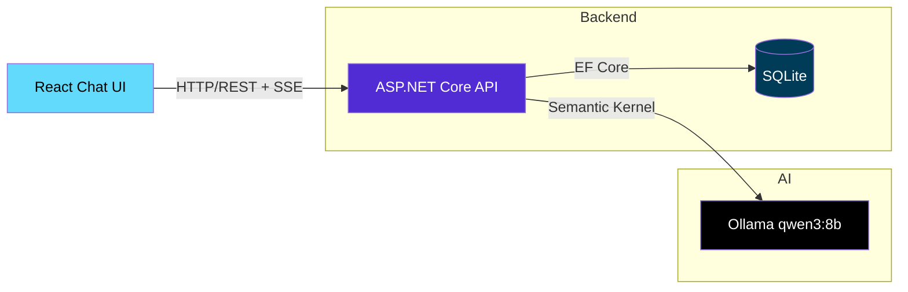

# Smart FAQ Chatbot

> A production-ready conversational FAQ chatbot built with **ASP.NET Core 10**, **React 19**, **Semantic Kernel**, and **Ollama (qwen3:8b)** — featuring real conversation memory, session persistence, and streaming responses.

[](https://dotnet.microsoft.com/)
[](https://react.dev/)
[](https://www.typescriptlang.org/)
[](https://learn.microsoft.com/en-us/semantic-kernel/)
[](https://ollama.com/)
[](https://learn.microsoft.com/en-us/ef/core/)
[](https://www.sqlite.org/)
[](LICENSE)

---

## 🎯 Project Overview

**Smart FAQ Chatbot** is a full-stack AI-powered conversational assistant that demonstrates modern .NET and React development practices. It maintains multi-turn conversation context, persists chat history to a local SQLite database, and streams token-by-token responses for a natural chat experience.

### Why This Project Stands Out

| Feature                 | Implementation                                                                       |
| ----------------------- | ------------------------------------------------------------------------------------ |
| **Conversation Memory** | Semantic Kernel `ChatHistory` with role-aware context (System/User/Assistant)        |
| **Session Persistence** | EF Core + SQLite — sessions survive app restarts                                     |
| **Streaming UX**        | Server-Sent Events (SSE) for token-by-token rendering                                |
| **Production Patterns** | Polly resilience, FluentValidation, rate limiting, structured logging, health checks |
| **Clean Architecture**  | Core / Infrastructure / API separation with dependency inversion                     |
| **Config-Driven LLM**   | Switch between local Ollama and cloud endpoints (OpenAI-compatible) via config       |

---

## 🏗️ Architecture



### Tech Stack

| Layer                | Technology                                                    |
| -------------------- | ------------------------------------------------------------- |
| **Backend API**      | ASP.NET Core 10 (Controllers, Minimal APIs where appropriate) |
| **AI Orchestration** | Microsoft Semantic Kernel (ChatHistory, Streaming)            |
| **LLM**              | Ollama local — `qwen3:8b` (configurable to OpenAI/OpenRouter) |
| **Database**         | SQLite via EF Core 9 (Code-First Migrations)                  |
| **Frontend**         | React 19 + TypeScript + Vite + Bootstrap 5.3                  |
| **Resilience**       | Polly (Retry, Circuit Breaker, Timeout)                       |
| **Validation**       | FluentValidation                                              |
| **Observability**    | Serilog (Structured Logging), Health Checks                   |
| **API Docs**         | Scalar (OpenAPI/Swagger UI)                                   |

---

## ✨ Features

### Core Chat Experience

- 💬 **Multi-turn conversations** — remembers context across 10+ turns
- 📝 **Markdown rendering** — code blocks, lists, links render beautifully
- ⚡ **Streaming responses** — tokens appear in real-time via SSE
- 🌙 **Dark/Light mode** — system-aware with manual toggle

### Session Management

- ➕ Create new chat sessions
- 📋 List all sessions with preview
- 🔄 Switch between sessions instantly
- 🗑️ Delete sessions
- 💾 **Full persistence** — SQLite survives restarts

### Production Readiness

- ✅ Input validation (FluentValidation)
- ✅ Rate limiting (per-IP)
- ✅ Request size limits (Kestrel)
- ✅ Retry + Circuit Breaker (Polly)
- ✅ Structured logging (Serilog)
- ✅ Health endpoints (`/health`, `/health/ready`)
- ✅ API documentation (Scalar)

---

## 🚀 Quick Start

### Prerequisites

- [.NET 10 SDK](https://dotnet.microsoft.com/download/dotnet/10.0)
- [Node.js 20+](https://nodejs.org/)
- [Ollama](https://ollama.com/) with `qwen3:8b` model

```bash
# Pull the model
ollama pull qwen3:8b
```

### Run Locally

```bash
# 1. Clone and navigate
git clone <your-repo-url>
cd SmartFaqChatbot

# 2. Start Ollama (separate terminal)
ollama serve

# 3. Backend: Restore, migrate, run
cd server/SmartFaqChatbot.Api
dotnet restore
dotnet ef database update
dotnet run
# API runs on http://localhost:5xxx (check console)

# 4. Frontend: Install & run (new terminal)
cd ../../client
npm install
npm run dev
# UI runs on http://localhost:5173 (proxies /api to backend)
```

### Environment Configuration

Create `server/SmartFaqChatbot.Api/appsettings.Development.json`:

```json
{
  "LLM": {
    "Endpoint": "http://localhost:11434",
    "Model": "qwen3:8b"
  },
  "ConnectionStrings": {
    "DefaultConnection": "Data Source=chatbot.db"
  },
  "Serilog": {
    "MinimumLevel": "Information"
  }
}
```

For **cloud deployment**, swap to OpenAI-compatible endpoint:

```json
{
  "LLM": {
    "Endpoint": "https://openrouter.ai/api/v1",
    "Model": "qwen/qwen-2.5-7b-instruct",
    "ApiKey": "${OPENROUTER_API_KEY}"
  }
}
```

---

## 📁 Project Structure

```
SmartFaqChatbot/
├── server/
│   ├── SmartFaqChatbot.Api/           # Controllers, Program.cs, DI config
│   │   ├── Controllers/
│   │   │   ├── ChatController.cs      # POST /api/chat, /api/chat/stream
│   │   │   └── SessionsController.cs  # CRUD for sessions/messages
│   │   ├── Middleware/
│   │   ├── Filters/
│   │   └── Program.cs
│   ├── SmartFaqChatbot.Core/          # Domain: Entities, Interfaces, DTOs
│   │   ├── Entities/
│   │   │   ├── ChatSession.cs
│   │   │   └── ChatMessage.cs
│   │   ├── Interfaces/
│   │   │   └── IChatService.cs
│   │   └── DTOs/
│   └── SmartFaqChatbot.Infrastructure/ # Implementations: EF Core, Ollama Service
│       ├── Data/
│       │   └── AppDbContext.cs
│       ├── Services/
│       │   └── OllamaChatService.cs
│       └── Migrations/
├── client/                            # React + TypeScript + Vite
│   ├── src/
│   │   ├── components/
│   │   │   ├── ChatWindow.tsx
│   │   │   ├── ChatMessage.tsx
│   │   │   ├── ChatInput.tsx
│   │   │   ├── SessionList.tsx
│   │   │   └── ThemeToggle.tsx
│   │   ├── hooks/
│   │   │   ├── useChat.ts
│   │   │   └── useSessions.ts
│   │   ├── services/
│   │   │   └── api.ts
│   │   ├── types/
│   │   └── main.tsx
│   ├── vite.config.ts
│   └── package.json
├── SmartFaqChatbot.slnx
└── README.md
```

---

## 🔌 API Reference

### Chat Endpoints

| Method | Endpoint           | Description                                  |
| ------ | ------------------ | -------------------------------------------- |
| `POST` | `/api/chat`        | Non-streaming reply (persists history)       |
| `POST` | `/api/chat/stream` | SSE streaming reply (persists on completion) |

**Request:**

```json
{
  "sessionId": "guid-or-null",
  "content": "What is your refund policy?"
}
```

**Streaming Response (SSE):**

```
data: {"role":"assistant","content":"Our","done":false}
data: {"role":"assistant","content":" refund","done":false}
data: {"role":"assistant","content":" policy...","done":true}
```

### Session Endpoints

| Method   | Endpoint                      | Description            |
| -------- | ----------------------------- | ---------------------- |
| `GET`    | `/api/sessions`               | List all sessions      |
| `GET`    | `/api/sessions/{id}/messages` | Load full conversation |
| `POST`   | `/api/sessions`               | Create new session     |
| `DELETE` | `/api/sessions/{id}`          | Delete session         |

---

## 🧪 Testing the Conversation Flow

```bash
# 1. Start a conversation
curl -X POST http://localhost:5xxx/api/chat/stream \
  -H "Content-Type: application/json" \
  -d '{"content":"What is your return policy?"}'

# 2. Follow-up (context remembered)
curl -X POST http://localhost:5xxx/api/chat/stream \
  -H "Content-Type: application/json" \
  -d '{"sessionId":"<id-from-above>","content":"Does it apply to sale items?"}'

# 3. Verify persistence - restart API, then:
curl http://localhost:5xxx/api/sessions/<id>/messages
```

---

## 🛡️ Production Patterns Implemented

### Resilience (Polly)

```csharp
// Retry with exponential backoff
policy = Policy
  .Handle<HttpRequestException>()
  .WaitAndRetryAsync(3, retry => TimeSpan.FromSeconds(Math.Pow(2, retry)));

// Circuit breaker
policy = Policy
  .Handle<HttpRequestException>()
  .CircuitBreakerAsync(5, TimeSpan.FromSeconds(30));
```

### Validation (FluentValidation)

```csharp
public class ChatRequestValidator : AbstractValidator<ChatRequest>
{
    public ChatRequestValidator()
    {
        RuleFor(x => x.Content)
            .NotEmpty()
            .MaximumLength(10000);
    }
}
```

### Health Checks

```csharp
builder.Services.AddHealthChecks()
    .AddSqlite("Data Source=chatbot.db")
    .AddUrlGroup(new Uri("http://localhost:11434/api/tags"), "Ollama");
```

---

## 📊 Observability

**Structured Logs (Serilog):**

```
[INF] Chat message received: {UserId} {SessionId} Turn=3
[INF] Reply generated: {Tokens=142} in {ElapsedMs=847} ms
[WRN] Rate limit exceeded: {ClientIp}
```

**Metrics to Track:**

- Tokens per request
- Latency (first token / complete)
- Session duration
- Error rates by type

---

## 🚢 Deployment

### Option A: Cloud LLM (Recommended for Portfolio)

- Deploy API + Frontend to **Render**, **Railway**, or **Azure App Service**
- Use **OpenRouter** (free tier) or **OpenAI** for LLM
- Same code, different `appsettings.json`

### Docker (Multi-stage)

```dockerfile
# Build stage
FROM mcr.microsoft.com/dotnet/sdk:10.0 AS build
WORKDIR /src
COPY . .
RUN dotnet publish -c Release -o /app

# Runtime stage
FROM mcr.microsoft.com/dotnet/aspnet:10.0
WORKDIR /app
COPY --from=build /app .
ENTRYPOINT ["dotnet", "SmartFaqChatbot.Api.dll"]
```

---

## 📚 What I Learned

Building this from scratch taught me:

| Area                            | Key Takeaway                                                               |
| ------------------------------- | -------------------------------------------------------------------------- |
| **Semantic Kernel ChatHistory** | Role-based messages (System/User/Assistant) enable true multi-turn context |
| **Token Budget Management**     | Trimming history to last N turns prevents context overflow                 |
| **EF Core Code-First**          | Migrations, DbContext config, navigation properties for sessions/messages  |
| **SSE Streaming**               | `IAsyncEnumerable` + `text/event-stream` for real-time UX                  |
| **Clean Architecture**          | Core defines contracts; Infrastructure implements; API composes            |
| **Config-Driven LLM**           | One codebase → local dev (Ollama) or cloud (OpenRouter)                    |

---

## 🗺️ Roadmap

- [ ] **Semantic Search** — Embeddings + vector similarity over FAQ corpus
- [ ] **RAG Integration** — Retrieve relevant docs before answering
- [ ] **Authentication** — User accounts, private sessions
- [ ] **Analytics Dashboard** — Conversation metrics, popular topics
- [ ] **Multi-language Support** — i18n for global FAQ

---

## 📄 License

MIT License — see [LICENSE](LICENSE) for details.

---

## 🤝 Connect

**Built by [Your Name]**

- 💼 [LinkedIn](https://linkedin.com/in/yourprofile)
- 🐙 [GitHub](https://github.com/yourusername)
- 📝 [Blog](https://yourblog.dev)

> _"From zero to production chatbot: mastering conversation state, streaming, and persistence in ASP.NET Core."_
